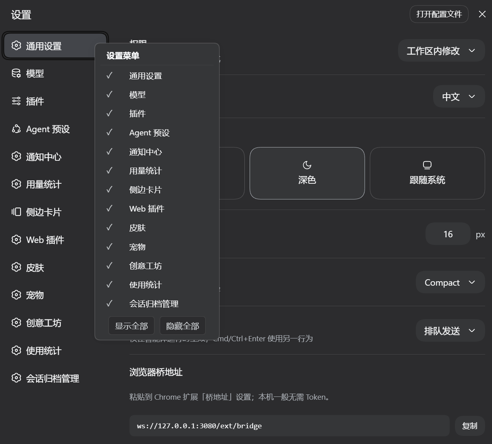

# dsh-setting-manager
中文 | [English](docs/README.en.md)

DSH 插件：右键设置页的分区导航，弹出勾选菜单，控制各设置分区的显示与隐藏。
隐藏是纯视觉的（`display:none`），不影响任何功能；显隐状态落盘到
`$DSH_HOME/dsh-setting-manager.json`，跨浏览器共享。

| 版本 | 0.1.0 |
|---|---|
| 形态 | 纯 JS（`"type": "module"`），`lib/` 即源码，无构建步骤 |
| 端 | Host（loopback route）+ Client（浏览器菜单），各一个入口 |

## 效果


## 功能

- **右键勾选菜单**：在设置分区导航上任意位置（含标题区）右键，弹出「设置菜单」
  浮层，按序列出全部设置分区，每行带勾选标记。`✓` 表示该分区可见，空白表示已隐藏；
  点击行立即切换，菜单保持打开，可以连续点几行，每点一下即生效并持久化。
  菜单只在点击它之外或按 `Escape` 时关闭。
- **显示全部 / 隐藏全部**：菜单底部两个按钮，批量操作；点击同样不关菜单。
- **全隐藏提示**：允许隐藏任意分区，包括全部。导航里没有任何可见分区时，
  菜单即时显示一行居中的「当前已全部隐藏」（DSH 警示色）；恢复一个分区后
  提示即时消失。导航标题区仍可右键唤回菜单。
- **跨浏览器持久化**：显隐状态经 Host 端 loopback route 读写，落盘到
  `$DSH_HOME/dsh-setting-manager.json`。多个浏览器、标签页共享同一份状态；
  每次打开菜单都从 Host 读回并与当前分区校准。
- **主题跟随**：浮层的字体、间距、圆角、阴影、背景、勾选、悬停全部使用 DSH
  主题变量（`--dsw-alias-*` / `--dsw-font-family` / `--dsw-elevation-*`），
  亮 / 暗主题自动跟随；宽度随内容自适应，长分区名不截断。
- **自动重新应用**：分区增减、语言切换、导航重建时自动重新匹配标签并重新
  应用隐藏态（文本匹配为主，下标兜底）。

## 安装

```powershell
dsh plugin --profile web add github:coderHeJiyu/dsh-setting-manager
```

从 GitHub 仓库直接安装，拉取默认分支的最新提交。前提（DSH / Node.js /
pnpm）、验证、本地源码挂载、更新与卸载详见 [安装指南](docs/installation.zh.md)

## 使用

1. 打开 DSH web GUI → 设置页。
2. 在左侧分区导航上任意位置右键。
3. 点行切换分区显隐；底部「显示全部」/「隐藏全部」批量操作。
4. 刷新页面、换浏览器，状态不变。

## 状态文件

位置：`$DSH_HOME/dsh-setting-manager.json`（`$DSH_HOME` 环境变量优先，
默认 `~/.dsh`）。

```json
{
  "version": 1,
  "hidden": [
    "models"
  ]
}
```

- `hidden` 是被隐藏分区的 id 数组（`settings.section` 条目的 `options.id`，
  如 `general` / `models` / `plugins` / `agent-presets`）。
- 读回退：文件不存在、解析失败、顶层非对象，一律按 `{ "version": 1, "hidden": [] }`
  处理；缺 `version` 字段（旧格式）按 v1 并补字段；`hidden` 非数组按空数组。
  任何情况都不报错。
- 原子写：先写 `dsh-setting-manager.json.tmp` 再 rename 覆盖，避免写一半损坏；
  残留的 `.tmp` 由下次写入覆盖。
- 2 空格缩进，UTF-8，无 BOM。

## API 与安全

Host 端在 `webServer` 下注册 `/api/setting-manager`，只有两个方法，
其余方法返回 `405` + `Allow: GET, POST`：

```
GET  → 200  { "version": 1, "hidden": ["models"] }
POST body { "hidden": ["plugins"] } → 200  { "version": 1, "hidden": ["plugins"] }
```

安全校验逻辑：

| 场景 | 响应 |
|---|---|
| 对端不是 loopback（不在 127.0.0.0/8、`::1` 及其 IPv4-mapped 形式内） | 403 |
| Host 头不是 loopback 主机名（防 DNS rebinding） | 403 |
| `sec-fetch-site: cross-site` | 403 |
| POST 缺 Origin，或 Origin 与请求源不同源 | 403 |
| content-length 非法 / 请求体不是合法 JSON | 400 |
| 请求体超过 16 KB | 413 |
| 写盘失败 | 400 |

所有响应带 4 个安全头：`cache-control: no-store`、`x-content-type-options: nosniff`、
`cross-origin-resource-policy: same-origin`、`referrer-policy: no-referrer`。
`hidden` 数组中的非字符串元素会被过滤。空 body 按 `{}` 处理，等于清空隐藏列表。
状态只经此 route 读写，插件不暴露其它网络入口；`webServer` 缺席
（如 headless profile）时不注册。

## 依赖

- `@deepseek-ai/dsh-home-paths`、`@deepseek-ai/dsh-host-webserver`：DSH 自带包，
  由 profile 的 `node_modules` 提供，无需单独安装。
- `@deepseek-ai/cordis`（`^4.0.1`）：可选 peer，由宿主提供。
- Client 端经 `package.json` 的 `dsh.client.inject` 声明
  `@deepseek-ai/dsh-client-runtime` 与 `@deepseek-ai/dsh-client-ui-slots`：
  后者提供分区标签解析（语言 thunk 按当前语言求值），不可解析时回退到
  语义等价的本地实现。

## 项目结构

```
dsh-setting-manager/
├── lib/
│   ├── index.js      # Host：注册 /api/setting-manager + 状态文件读写
│   └── client.js     # Client：右键菜单、display:none 应用器、fetch 同步、主题样式
├── cordis.patch.yml  # 插件注册 patch（insert id: setting-manager）
├── package.json
└── .gitignore
```

纯 JS，`lib/` 直接入库；没有 tsconfig、构建产物和测试框架。

本地开发热更（`dsh web` 运行中）：源码用 `link:` 软链安装
（`dsh plugin --profile web add link:/path/to/checkout`）后，client-hmr
每 500 ms（默认）stat 轮询一次 client bundle，变化经 SSE 广播，浏览器重新
执行 client 入口，无需手动刷新。

- 改 `lib/client.js`：按上述机制自动重载。
- 改 `lib/index.js`：Host 在启动时加载，需重启 `dsh web`。

## 已知限制

- 隐藏是纯视觉的：被隐藏分区仍挂载在 React 树中，其快捷键与编程入口照常有效
  （对齐 VS Code 的 Hide View 口径）。
- 状态文件按 DSH home 全局一份，不按 profile 区分：多个 profile 安装本插件时
  共享同一份显隐列表。
- 右键识别依赖 nav 按钮文本与分区标签的匹配（压缩空白后按多重集比对）；
  对不上时（如自定义分区没有标签）不弹菜单，保留默认右键行为。
- 只管 `settings.section` 分区导航，设置页内部的子控件不在控制范围。
